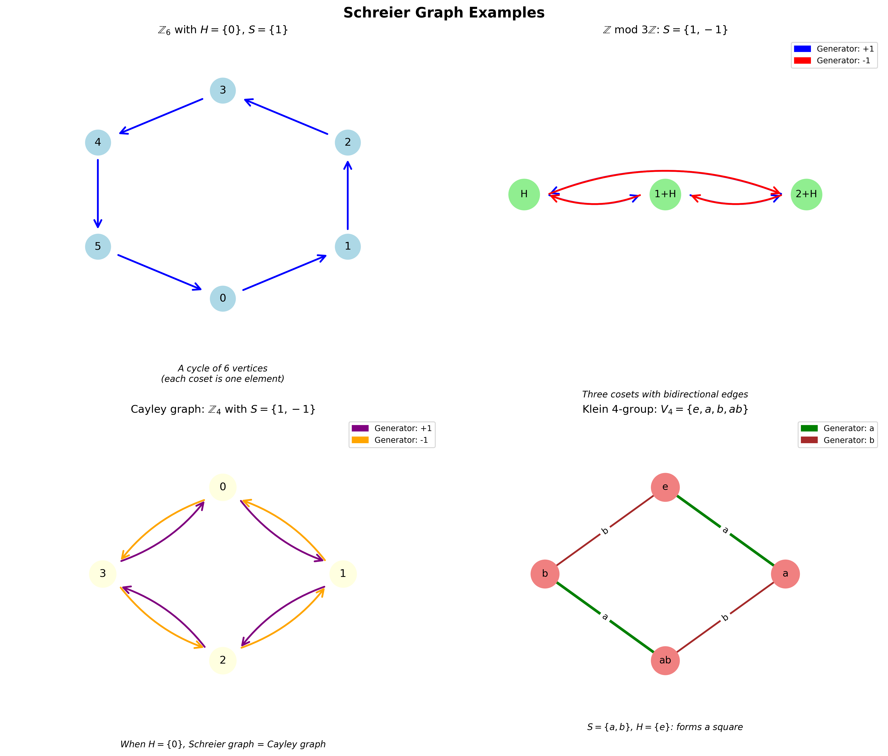

2026.01.14

# Schreier/coset graph definition and examples

* https://github.com/ftk1000/1_deep_learn_class/blob/main/schreier_graphs.ipynb
  
* https://claude.ai/chat/f2f38a9b-5e5d-4020-9897-a1d3289a439c



# Schreier Graphs (Coset Graphs)

## Definition

A **Schreier graph** (or coset graph) is a visual representation of how a group $G$ acts on the cosets of a subgroup $H$ via a generating set $S$.

### Formal Definition

Given:
- A group $G$ with generating set $S = \{s_1, s_2, \ldots, s_k\}$
- A subgroup $H \leq G$

The **Schreier graph** $\Gamma(G, H, S)$ is constructed as follows:

- **Vertices**: The left cosets $\{gH : g \in G\}$
- **Edges**: For each coset $gH$ and generator $s \in S$, draw a directed edge labeled $s$ from $gH$ to $sgH$

## Intuitive Analogy

Think of a Schreier graph like a **metro/subway map**:
- Each **station** (vertex) represents a "position" in the group (a coset)
- Each **train line** (edge color) represents a generator - a specific "move" you can make
- The **network structure** shows all possible journeys by repeatedly taking trains
- The subgroup $H$ determines your "equivalence" - which positions you consider "the same station"

## Key Properties

1. The graph is **regular** if $S$ is symmetric ($s \in S \Rightarrow s^{-1} \in S$)
2. The graph is **connected** if and only if $G = \langle S, H \rangle$
3. The number of vertices equals the index $[G:H]$
4. Closed paths starting at $H$ correspond to elements of $H$

## Examples

### Example 1: $\mathbb{Z}_6$ acting on itself

Let $G = \mathbb{Z}_6 = \{0, 1, 2, 3, 4, 5\}$ with generator $S = \{1\}$ and $H = \{0\}$ (trivial subgroup).

The Schreier graph is simply a **cycle of 6 vertices**:

```
0 --1--> 1 --1--> 2 --1--> 3 --1--> 4 --1--> 5 --1--> 0
```

### Example 2: $\mathbb{Z}$ acting on cosets of $3\mathbb{Z}$

Let $G = \mathbb{Z}$, $S = \{1, -1\}$, and $H = 3\mathbb{Z}$.

The three cosets are: $H$, $1+H$, $2+H$

This gives a **bi-infinite path with period 3**:

```
... <--1-- H --1--> 1+H --1--> 2+H --1--> H --1--> ...
```

### Example 3: Cayley Graph vs Schreier Graph

For $G = S_3$ (symmetric group), $S = \{(12), (123)\}$:

- **Cayley graph** (when $H = \{e\}$): Shows all 6 elements of $S_3$
- **Schreier graph** (when $H = \langle (12) \rangle$): Shows only 3 cosets: $H$, $(123)H$, $(132)H$

Let me create a visualization to illustrate these concepts:## Visual Examples Explained

The visualization shows four different Schreier graphs:

### 1. **Simple Cycle** ($\mathbb{Z}_6$)
When $H$ is trivial (just the identity), you get the full Cayley graph. Here, repeatedly applying generator $+1$ cycles through all elements.

### 2. **Quotient Structure** ($\mathbb{Z}/3\mathbb{Z}$)
The infinite group $\mathbb{Z}$ acting on three cosets of $3\mathbb{Z}$. The blue edges (generator $+1$) move forward, red edges (generator $-1$) move backward. This creates a periodic structure that "wraps around."

### 3. **Bidirectional Cayley Graph** ($\mathbb{Z}_4$)
With generators $\{1, -1\}$, you can move both clockwise and counterclockwise. Each pair of opposite arrows shows that these generators are inverses.

### 4. **Non-Cyclic Structure** (Klein 4-group)
The Klein 4-group $V_4$ has two independent generators of order 2. The graph forms a square, showing that all elements are one or two "steps" from the identity.

## Connection to Random Walks

Schreier graphs are fundamental in studying **random walks on groups**: 
- Each edge represents a possible "step" 
- Uniform random walk on the graph corresponds to multiplying by random generators
- Graph connectivity reveals group structure

## Why This Matters

Schreier graphs appear in:
- **Automata theory**: Recognizing languages with group symmetries
- **Covering spaces**: Fundamental groups acting on universal covers  
- **Cryptography**: Cayley hash functions
- **Geometric group theory**: Visualizing infinite groups

The key insight: **Group structure becomes geometric structure** — abstract algebra becomes visual topology!


====================

* https://chatgpt.com/c/6967cb6a-2a28-8331-b256-22108027f8d0

I’ll give a clean definition of Schreier (coset) graphs, relate them to Cayley graphs, then work through a few concrete examples (including one matching “adjacent transpositions” style).


A **Schreier graph** (also called a **coset graph**) is the natural graph you get when a group acts on something, and you draw edges corresponding to a chosen generating set.

## Definition (Schreier / coset graph)

Let

* $G$ be a group,
* $S\subseteq G$ a generating set (often taken symmetric: $S=S^{-1}$),
* $G$ act on a set $X$ (on the right or left—pick one and be consistent).

The **Schreier graph** $\mathrm{Sch}(G,X,S)$ is the (usually directed, edge-labeled) graph with:

* **Vertices:** the elements of $X$.
* **Edges:** for each $x\in X$ and each $s\in S$, an edge
  [
  x \xrightarrow{;s;} x\cdot s
  ]
  (if you use a right action; for a left action it’s $x\mapsto s\cdot x$).

If $S=S^{-1}$ and you forget orientations/labels, you get an undirected regular graph.

### Coset version (the “Schreier coset graph”)

A key special case is $X=G/H$, the set of (right) cosets of a subgroup $H\le G$, with the right action by multiplication:
[
(Hg)\cdot s = H(gs).
]
Then $\mathrm{Sch}(G,G/H,S)$ is the **coset graph**:

* **Vertices:** cosets $Hg$.
* **Edges:** $Hg \xrightarrow{s} H(gs)$ for $s\in S$.

## Relationship to Cayley graphs

The **Cayley graph** $\mathrm{Cay}(G,S)$ is exactly the Schreier graph for the action of $G$ on itself:
[
\mathrm{Cay}(G,S)=\mathrm{Sch}(G,G,S),
]
where $G$ acts on $G$ by right multiplication.

So: **Schreier graphs generalize Cayley graphs**.

## Example 1: $S_3$ acting on ${1,2,3}$

Let $G=S_3$, $X={1,2,3}$, action is the usual permutation action.
Take generators (transpositions)
[
S={(12),(23)}.
]

Vertices: $1,2,3$.

Edges:

* From $1$: $(12)$ sends $1\mapsto 2$, $(23)$ fixes $1$.
* From $2$: $(12)$ sends $2\mapsto 1$, $(23)$ sends $2\mapsto 3$.
* From $3$: $(12)$ fixes $3$, $(23)$ sends $3\mapsto 2$.

If you drop loops and directions, you basically get the path $1-2-3$ (plus loops if you keep the “fixed by generator” edges).

This is a classic: “Schreier graph of the action on points”.

## Example 2: Coset graph $G/H$ for $S_3 / \langle(12)\rangle$

Let

* $G=S_3$,
* $H=\langle(12)\rangle={e,(12)}$ (size 2),
  so $[G:H]=3$ cosets.

Take $S={(12),(23)}$ again.

Vertices are the 3 cosets:
[
H,\quad H(13),\quad H(23)
]
(one possible choice of representatives).

Edges: from $Hg$ to $H(gs)$ for each $s\in S$.

This gives a 3-vertex Schreier graph encoding how the generators move between cosets. (It’s a compact “quotient” of the Cayley graph—see next point.)

### View as a quotient of the Cayley graph

$\mathrm{Sch}(G,G/H,S)$ is the quotient of $\mathrm{Cay}(G,S)$ by identifying vertices in the same right coset of $H$.

## Example 3: “Adjacent transpositions” generating $S_n$ (permutohedron graph)

Let $G=S_n$ and let
[
S={s_i=(i\ i+1): i=1,\dots,n-1}.
]
Consider the action of $S_n$ on itself (right multiplication). Then the Schreier graph is the Cayley graph
[
\mathrm{Cay}(S_n,{s_1,\dots,s_{n-1}}).
]
This is the **1-skeleton of the permutohedron** (also called the **permutohedron graph**): vertices are permutations, edges swap adjacent positions.

For $n=4$:

* vertices: $4!=24$,
* each vertex has degree $n-1=3$ (because you can swap positions 1–2, 2–3, or 3–4).

## Example 4: Your “binary strings with adjacent swaps” as a Schreier graph

Take

* $G=S_n$ generated by adjacent transpositions $S={s_i=(i\ i+1)}$,
* let $X$ be the set of binary strings with $k$ ones (and $n-k$ zeros),
* action: a permutation $\sigma\in S_n$ acts on positions of the string.

Pick a base string
[
x_0 = 0^{,n-k}1^{,k}.
]
Then every binary string with $k$ ones is $\sigma\cdot x_0$ for some $\sigma$, and the stabilizer subgroup is
[
H \cong S_{n-k}\times S_k
]
(permuting zeros among themselves and ones among themselves).

So
[
X ;\cong; S_n / (S_{n-k}\times S_k),
]
and your graph of binary strings under adjacent swaps is exactly the Schreier (coset) graph
[
\mathrm{Sch}!\left(S_n,\ S_n/(S_{n-k}\times S_k),\ {(1,2),(2,3),\dots,(n-1,n)}\right).
]

This is a very standard viewpoint: the “binary adjacent-swap graph” is a Schreier graph of $S_n$.

## A few quick properties (useful intuition)

* **Connectedness:** If $S$ generates $G$ and the action is transitive on $X$, the Schreier graph is connected.
* **Regularity:** If $S$ is symmetric and you count loops/multiple edges appropriately, each vertex has (out-)degree $|S|$.
* **Cayley vs Schreier:** Cayley graphs encode the group itself; Schreier graphs encode the action (or coset space).

If you tell me the exact example you want (e.g., $n=5,k=2$ binary case, or a specific subgroup $H$), I can write out the full vertex set and edges explicitly and compute degrees/diameter.

